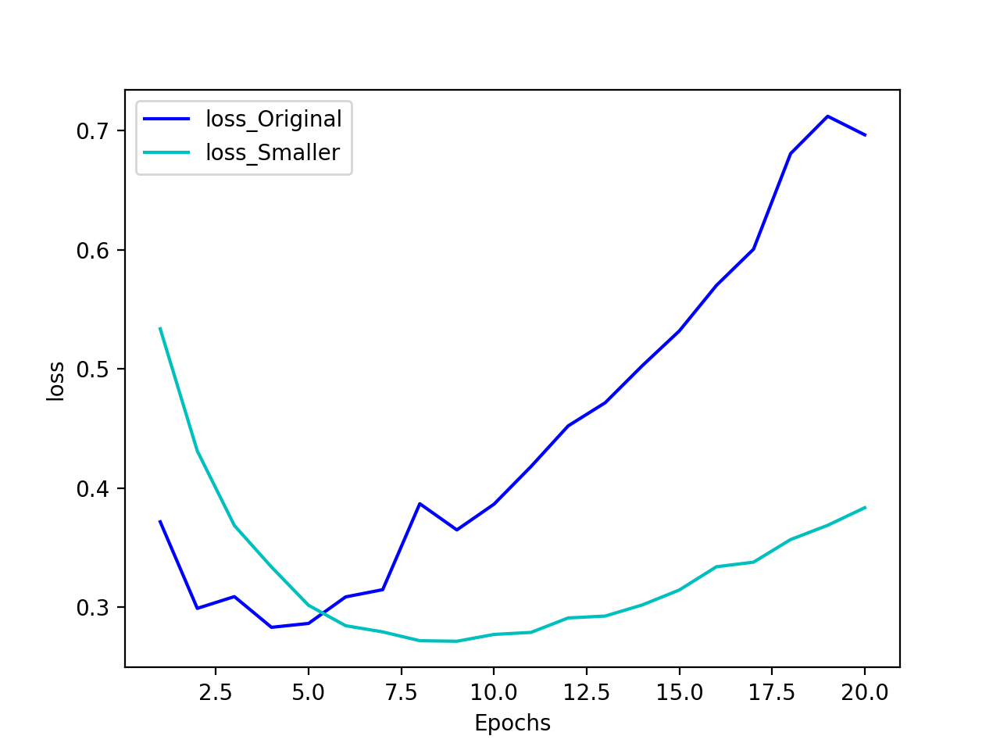
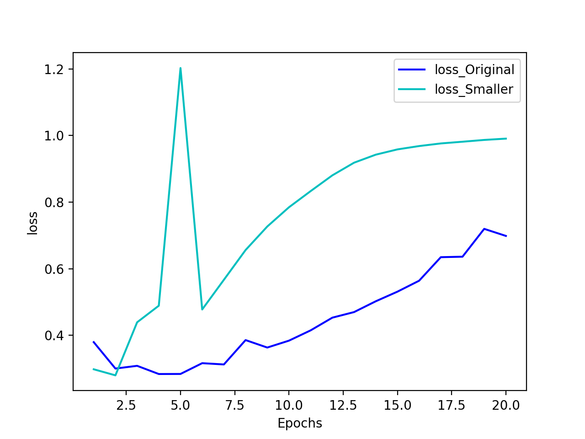
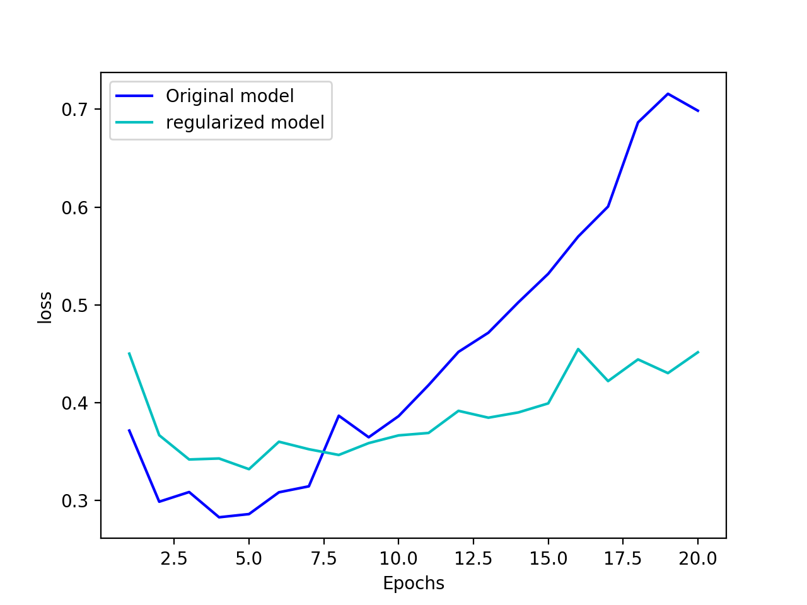
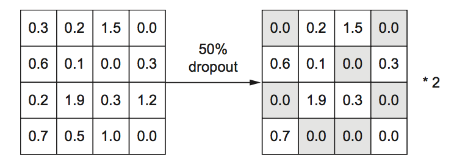
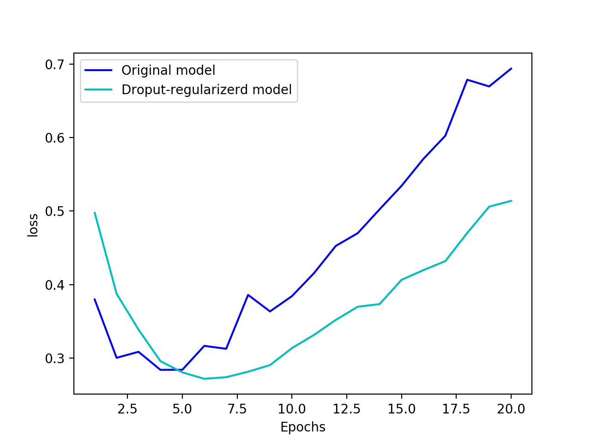
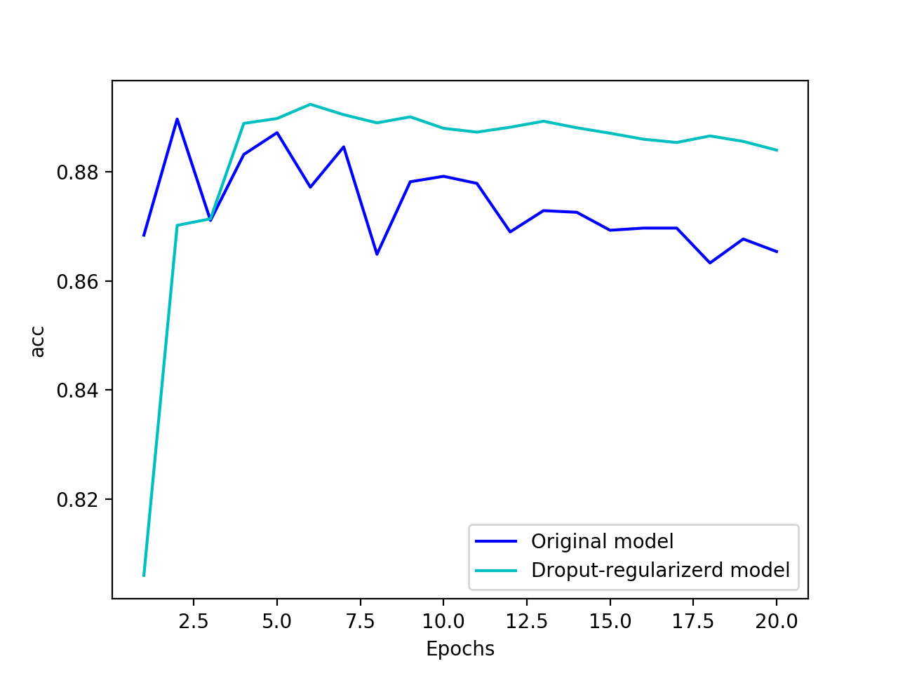

# 四、机器学习基础
-
* 人工智能 > **机器学习** > 深度学习 > 神经网络

## 4.1 机器学习的四个分支
### 4.1.1.监督学习
	找到训练输入与训练输出之间的关系
监督学习主要包括：分类问题、回归问题，还有更多的变体，主要包括：

* 序列生成（sequence generation 顺序一代）:给定一张图像，预测描述图像的文字。序列生成有时 可以被重新表示为一系列分类问题，比如反复预测序列中的单词或标记。？
* 语法树预测（syntax tree prediction 语法树预测）给定一个句子，预测其分解生成的语法树。<b>何为语法树？</b>
* 目标检测（object detection 对象发现）：给定一张图像，在图中特定目标的周围画一个边界框。这 个问题也可以表示为分类问题(给定多个候选边界框，对每个框内的目标进行分类)或分类与回归联合问题(用向量回归来预测边界框的坐标)
* 图像分割（image segmentation 图像分割）：给定一张图像，在特定物体上画一个像素级的掩模（mask）

### 4.1.2.无监督学习
	在没有目标（可能指损失函数）的情况下找到输入数据的有趣变换，其目的在于数据可视化、数据压缩、数据去噪或更好地理解数据中的相关性
* 降维（dimensionality reduction）
* 聚类（clustering）

### 4.1.3.自监督学习
	监督学习的一个特例：没有人工标注的标签的监督学习
* 标签依然存在（因为总要有什么东西来监督学习过程），但它们是从输入数据中生成的，通常是使用启发式算法生成的。
* 举个例子，自编码器(autoencoder)是有名的自监督学习的例子，其生成的目标就是未经 修改的输入。同样，给定视频中过去的帧来预测下一帧，或者给定文本中前面的词来预测下一个词， 都是自监督学习的例子[这两个例子也属于时序监督学习(temporally supervised learning)，即用 6 未来的输入数据作为监督]。注意，监督学习、自监督学习和无监督学习之间的区别有时很模糊， 这三个类别更像是没有明确界限的连续体。自监督学习可以被重新解释为监督学习或无监督学 习，这取决于你关注的是学习机制还是应用场 。

### 4.1.4.强化学习
智能体(agent)接收有关其环境的信息，并学会选择使某种奖励最大化的 **行动**
> 自我理解：监督学习是找出训练输入与训练输出之间的关系，而强化学习是接收信息，然后学会做出选择某行动，使某种奖励最大化

## 4.2 评估机器学习模型
	如何衡量模型的泛化能力
	
### 4.2.1. 训练集、验证集、测试集
将数据分为三个集合，训练集、验证集、测试集，而不是两个集合训练集和测试集。这样做主要原因在于，在训练集上训练模型，在开发时总需要调节模型超参数，这个调节过程需要使用模型在第二个集合上的性能作为反馈信号📶，这就导致第二个集合的信息会泄漏到模型中，模型在第二个集合上就过拟合，即使你**并没有直接**在第二个集合上训练模型也是如此，所以需要第三个集合（前所未见的数据集合）来做测试，评估模型的泛化能力

* 训练集：训练模型
* 验证集：评估模型，并做出调整
* 测试集：测试模型

* 划分集合的方法：
	1. 简单的留出验证集
	2. K折验证
	3. 带有打乱数据的重复K折验证

### 4.2.2. 评估模型的注意⚠️事项
* 数据代表性（data representativeness）
* 时间箭头➡️（the arrow of time）
* 数据冗余（redundancy in your data）


## 4.3 数据预处理、特征工程和特征学习
	将数据输入神经网络之前，如何准备输入数据和目标？数据预处理的目的是使原始数据更适于用神经网络处理
	
### 4.3.1. 神经网络的数据预处理
1. 向量化：将输入数据和目标都转换为张量
2. 标准化：要让网络的学习变得容易，输入数据应该具有以下特征：
	* 取值较小：大部分值都应该在0～1范围内。
	* 同质性（homogenous）：所有特征的取值都应该在大致相同的范围内。
	
	很有用的标准化方法：
	
	* 将每个特征分别标准化，使其平均值为 0
	* 将每个特征分别标准化，使其标准差为 1
	
		```
		x -= x.mean(axis=0)
		x /= x.std(axis=0)
		```
	
3. 处理缺失值：一般来说，对于神经网络，将缺失值设置为0是安全的，只要0不是一个有意义的值。网络能够从数据中学到0意味着缺失数据，并且会忽略这个值

### 4.3.2. 特征工程（feature engineering）
	利用你自己对数据和机器学习算法的知识对数据进行硬编码的变换，以改善模型的效果
* 良好的特征仍然可以让你用更少的资源更优雅地解决问题。例如，使用卷积神经网络来 读取钟面上的时间是非常可笑的
* 良好的特征可以让你用更少的数据解决问题。深度学习模型自主学习特征的能力依赖于 大量的训练数据。如果只有很少的样本，那么特征的信息价值就变得非常重要


## 4.4 过拟合和欠拟合
	机器学习的学习根本问题是优化和泛化之间的对立
* 优化（optimization）：调节模型以在训练数据上得到最佳性能
* 泛化（generalization）：训练好的模型在前所未有的数据上的性能好坏
* 欠拟合：网络还没有对训练数据中所有相关模式建模
* 过拟合：模型开始学习**仅**和训练数据有关的模式
* 解决过拟合的方法：
	1. 获取更多的训练数据
	2. 正则化：调节模型允许存储的信息量，或对模型允许存储的信息加以约束

几种常见的正则化方法：
### 4.4.1. 减小网络大小
参数更多的模型拥有更大的记忆容量(memorization capacity)，因此能 够在训练样本和目标之间轻松地学会完美的字典式映射，这种映射没有任何泛化能力。与此相反，如果网络的记忆资源有限，则无法轻松学会这种映射。因此，为了让损失最小化，网络必须学会对目标具有很强预测能力的压缩表示，这也正是我们感兴趣的数据表示。**需要在容量过大与容量不足之间要找到一个折中**

* 一般的工作流程是：开始时选择相对较少的层和参数，然后逐渐增加层的大小或增加层，直到这种新增对验证损失的影响变得很小
* **⚠️始终牢记：深度学习模型通常都很擅长拟合训练数据，但真正的挑战在于泛化，而不是拟合**

[影评分类例](https://github.com/CLgithub/tensorFlowLearn/tree/master/learn2/0-book/4/book4.4.1.py)

* 模型容量对验证损失的影响:换用更小的网络

* 模型容量对验证损失的影响:换用更大的网络


**👻：所以减小网络能防止过拟合，但网络不能过小，以防止欠拟合**

### 4.4.2. 添加权重这则化
简单模型比复杂模型更不容易过拟合，此处的简单模型（simple model）是指参数分布的熵更小的模型（或参数更少的模型，比如上一节的例子）。因此，一种常见的降低过拟合的方法就是**强制让模型权重只能取较小的值**， 从而限制模型的复杂度，这使得权重值的分布**_更加规则(regular)_**。这种方法叫作权重正则化（weight regularization）

自我理解👻：使权重更加规则更加正则化，更具有普遍性，从而更不容易过拟合

实现方法是：向**网络损失函数**中添加与**较大权重值相关的成本（cost）**，这个成本有两种形式：
	
1. L1正则化（L1 regularization）：添加的成本与权重系数的绝对值成正比
2. L2正则化（L2 regularization）：添加的成本与权重系数的平方成正比

[影评分类例](https://github.com/CLgithub/tensorFlowLearn/tree/master/learn2/0-book/4/book4.4.2.py)

<center>绿线比蓝线更不容易过拟合</center>

* l2(0.001)的意思是该层权重矩阵的**每个系数**都会使网络**总损失**增加0.001 * weight_ coefficient_value。注意，由于这个惩罚项只在训练时添加，所以这个网络的训练损失会 比测试损失大很多

	👻:训练时损失大了，校验时损失就不那么大了

* Keras 中不同的权重正则化项：
	* regularizers.l1(0.001) -----> L1正则化
	* regularizers.l1_l2(l1=0.001, l2=0.001) -----> 同时做L1和L2正则化

	
### 4.4.3. 添加dropout正则化
👻：其实就是随机失活<br>
对某一层使用dropout，就是在训练过程中随机将该层的一些输出特征舍弃(设置为0)，**dropout比率(dropout rate)**是被设为 0 的特征所占的比例，通常在**0.2~0.5**范围内。测试时没有单元被舍弃，而该层的输出值需要按 dropout 比率缩小，因为这时比训练时有更多的单元被激活，需要加以平衡。<br>
👻：训练时使用了dropout后，测试时就要按比率缩小，或者训练时使用了dropout后，按比率放大，测试时就可保持不变，[见例](https://github.com/CLgithub/tensorFlowLearn/tree/master/learn2/0-book/4/book4.4.3_1.py)

<center>训练时对激活矩阵使用dropout，并在训练时成比例增大。测试时激活矩阵保持不变</center>

[影评分类例](https://github.com/CLgithub/tensorFlowLearn/tree/master/learn2/0-book/4/book4.4.3_2.py)

<center>绿线比蓝线更不容易过拟合</center>


<center>绿线精度也比蓝线精度更高更稳定</center>

### 总结，防止神经网络过拟合的常用方法包括：
1. 获取更多的训练数据
2. 减小网络容量
3. 添加权重正则化
4. 添加dropout

	👻：可以考虑几种方法一起用上

## 4.5 机器学习的通用工作流
本节将介绍一种可用于解决任何机器学习问题的通用模版。这一模版将你在本章学到的这些概念串在一起：**问题定义、评估、特征工程、解决过拟合**
### 4.5.1. 定义问题，收集数据集
👻：需要解决什么问题、有哪些数据

* 你输入的数据时什么？你要预测什么？
* 你面对的是什么类型的问题？确定问题分类有助于选择模型框架、损失函数
* 假设输出是可以根据输入进行预测的
* 假设可用数据包含足够多的信息，足以学习输入和输出之间的关系

### 4.5.2. 选择衡量成功的指标
👻：要优化什么

* 平衡分类问题（每个类别的可能性相同）：精度、接受者操作特征曲线下面积（area under the receiver operating characteristic curve，ROC AUC）
* 类别不平衡：准确率、召回率
* 排序问题或多标签分类：平均准确率均值（mean average precision）
* 自定义衡量成功指标

### 4.5.3. 正确评估方法
👻：如何评估验证

* 留出验证集
* K折交叉验证
* 重复的K折验证

### 4.5.4. 准备数据
一旦知道了要训练什么、要优化什么以及评估方法，那么你就几乎已经准备好了模型，首先应将数据格式化，使其可以输入到机器学习模型中（假设模型为深度神经网络）

* 数据向量化：数据格式化为张量⚙️（4.3.1数据预处理）
* 数据标准化1：取值较小，这些张量的取值通常应该缩放为较小的值
* 数据标准化2：同质性，如果不同的特征具有不同的取值范围(异质数据)，那么应该做数据标准化
* 特征工程：利用你自己对数据和机器学习算法的知识对数据进行硬编码的变换

### 4.5.5. 开发比基准更好的模型
目标：获得**统计功效（statistical power）**，即开发一个小型模型，它能打败纯随机的基准（dumb baseline），如在手写数字识别中随机基准为10%，（[但在谷歌最新的“权重无关” 神经网络这种特色架中，构建出的随机权重的模型，精度可>80%](https://github.com/google/brain-tokyo-workshop/tree/master/WANNRelease)）,任何这个精度的模型都可以说具有统计功效；
但不一定会获得随机功效，要注意两个假设：
	
	* 假设输出是可以根据输入进行预测的
	* 假设可用的数据包含足够多的信息，足以学习输入和输出之间的关系
 
三个参数构建第一个工作模型：

* 最后一层的激活
* 损失函数
* 优化器
* 👻（衡量指标）

构建模型和编译模型时，选择正确的模块：

——|最后一层的激活|损失函数|优化器|衡量指标
:--|:--:|:--:|:--:|:--:
**二分类**|sigmoid|binary\_crossentropy<br>(二元交叉熵)|rmsprop(SGD的变体)|accuracy
**多分类、单标签**|softmax|categorical_crossentropy<br>(分类交叉熵,one-hot分类编码)<br>sparse\_categorical\_crossentropy<br>(稀少分类交叉熵,整数张量)|rmsprop|accuracy
**多分类、多标签**|sigmoid|binary_crossentropy||
**回归（任意值）**|无|mse<br>(均方误差mean squared error)|rmsprop|mea<br>(平均绝对误差mean absolute error)
**回归（0～1）**|sigmoid|mse 或 binary_crossentropy|||

### 4.5.6. 扩大模型规模：开发过拟合的模型
### 4.5.7. 模型正则化与调节超参数 


