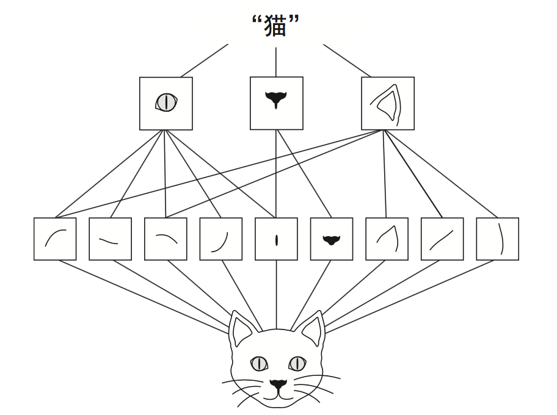

# 五、深度学习用于计算机视觉
-
本章包括以下内容:

* 理解卷积神经网络(convnet)
* 使用数据增强来降低过拟合
* 使用预训练的卷积神经网络进行特征提取
* 微调预训练的卷积神经网络
* 可视化

👻：学完本章目标，能自己编写验证码识别程序，动物🐒图片分类程序等等

## 5.1 卷积神经网络简介
* [全连接神经网络图片分类](https://github.com/CLgithub/tensorFlowLearn/blob/master/learn2/0-book/3/book2.1.py)
* [简单卷积神经网络图片分类](https://github.com/CLgithub/tensorFlowLearn/blob/master/learn2/0-book/5/book5.1.py)

简单卷积神经网络 比 全连接神经网络 提升2%的精度

### 5.1.1 卷积运算
👻：为何卷积神经网络会有如此优势？

密集连接层和卷积层的根本区别在于：

* Dense层---全局模式
* 卷积层---局部模式

正是因为这个重要的特性使得 卷积神经网络 具有以下两个有趣性质（👻视觉优势）：

* 学到的模式具有**平移不变性**：因为**视觉世界从根本上具有平移不变性**，在左下角学到的模式可以应用于右上角，能高效的利用数据
* 能学到**模式的空间层次结构**：因为**视觉世界从根本上具有空间层次结构**，第一个卷积层将学习较小的局部模式，第二个卷积层将学习由第一层特征 组成的更大的模式，以此类推；

视觉世界形成了视觉模块的空间层次结构:超局部的边缘组合成局部的对象， 比如眼睛或耳朵，这些局部对象又组合成高级概念，比如“猫”

* **响应图**：某个过滤模式在输入中不同位置的响应（相当于一层）
* **特征图**：所有过滤器(特征)的响应图总和

对于包含两个空间轴(高度和宽度)和一个深度轴(也叫通道轴)的 3D 张量，其卷积也叫**特征图**(feature map)，RGB图像，深度轴的维度大小等于3，卷积运算从输入特征图中提取图块，并对所有这些图块应用相同的变换，生成**输出特征图**(output feature map)，该输出特征图扔是一个3D张量，（宽,高,通道），**不过此时通道不再只代表特定颜色，而可以代表更高层次的过滤器**，比如，单个过滤器可以从更高层次编码这样 一个概念:“输入中包含一张脸。” 👻：“输入中包含红色”

卷积神经网络的工作原理，两种理解方式：

1. 在3D输入特征图(28\*28\*3)上滑动这些3*3的窗口， 
在每个可能的位置停止并提取周围特征的3D图块，假设步长为1，共26\*26个图块，每个shape=(win\_height,win\_width,input\_depth)(3,3,3)，(26,26,3,3,3)，若把一个图块(窗口)看成一个整体,(26,26,3) 
共out\_depth(32)个特征,通道 
然后 **每个3D图块** 与 **每个特征的权重矩阵** (卷积核，shape=(input\_depth,out\_depth)(3,32))做张量点积（**卷积**） 
每个特征对全部图块的响应为响应图(26,26,1) 
所有的响应图总和得到输出特征图(shape=(height,width,output\_depth)(26,26,32))

2. 
   

注意⚠️：输出的宽度和高度可能与输入的宽度和高度不同。不同的原因可能有两点

* 边界效应与填充：窗口在图上移动，边界的某些像素不能被窗口正对扫到，使得响应图尺寸与输入尺寸不同。若想要相同，可以使用**填充**，对于 Conv2D 层，可以通过padding参赛来设置填充，
	* padding=valid（默认）不使用填充
	* padding=same 填充后输出的宽度和高度与输入相同
* 卷积步幅：窗口每次移动的步长，默认=1，步副>1的称为**步进卷积**，步幅为2意味着特征图的宽度和高度都被做了 2 倍下采样，实践中很少使用。

### 5.1.2 最大池化运算
最大池化的作用：对特征图进行下采样，与步进卷积类似

为什么要对特征图进行下采样？

* 有利于学习特征图的空间层级结构，通过让连续卷积层的观察窗口越来越大，即窗口覆盖原始输入的比例越来越大，从而引入空间过滤器的层级结构
* 减少需要处理的特征图的元素个数

下采样不一定都使用最大池化，还可以步副卷积、平均池化，但最大池化往往效果更好，原因在于特征中往往编码了某种模式或概念在特征图的不同位置是否存在，而观察不同特征的**最大值**而不是**平均值**能够给出更多的信息。

## 5.2 在小型数据集上从头开始训练一个卷积神经网络
* 从头开始训练一个小型模型
* 使用预训练的网络做特征提取
* 对预训练的网络进行微调

### 5.2.1 深度学习与小数据问题的相关性
深度学 习的一个基本特性就是能够独立地在训练数据中找到有趣的特征，无须人为的特征工程，而这 只在拥有大量训练样本时才能实现。 
但是如果模型很小， 并做了很好的正则化，同时任务非常简单，那么几百个样本可能就足够了。由于卷积神经网络 学到的是局部的、平移不变的特征，它对于感知问题可以高效地利用数据。虽然数据相对较少， 6 但在非常小的图像数据集上从头开始训练一个卷积神经网络，仍然可以得到不错的结果，而且 无须任何自定义的特征工程 
此外，深度学习模型本质上具有高度的可复用性，比如，已有一个在大规模数据集上训练 的图像分类模型或语音转文本模型，你只需做很小的修改就能将其复用于完全不同的问题。特 别是在计算机视觉领域，许多预训练的模型(通常都是在 ImageNet 数据集上训练得到的)现 7 在都可以公开下载，并可以用于在数据很少的情况下构建强大的视觉模型

### 5.2.2 下载数据
可到Keras下载[猫狗分类数据集](https://www.kaggle.com/ c/dogs-vs-cats/data)

### 5.2.3 构建网络
### 5.2.4 数据预处理
### 5.2.5 使用数据增强
## 5.3 使用预处理的卷积神经网络
### 5.3.1 特征提取
### 5.3.2 微调模型
### 5.3.3 小结
## 5.4 卷积神经网络的可视化
### 5.4.1 可视化中间激活
### 5.4.2 可视化卷积神经网络的过滤器
### 5.4.3 可视化类激活的热力图
