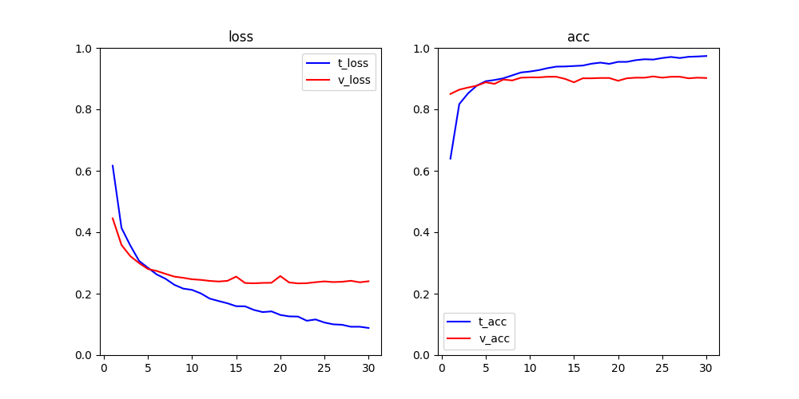

# 五、深度学习用于计算机视觉
-
本章包括以下内容:

* 理解卷积神经网络(convnet)
* 使用数据增强来降低过拟合
* 使用预训练的卷积神经网络进行特征提取
* 微调预训练的卷积神经网络
* 可视化

👻：学完本章目标，能自己编写验证码识别程序，动物🐒图片分类程序等等

## 5.1 卷积神经网络简介
* [全连接神经网络图片分类](https://github.com/CLgithub/tensorFlowLearn/blob/master/learn2/0-book/3/book2.1.py)
* [简单卷积神经网络图片分类](https://github.com/CLgithub/tensorFlowLearn/blob/master/learn2/0-book/5/book5.1.py)

简单卷积神经网络 比 全连接神经网络 提升2%的精度

### 5.1.1 卷积运算
👻：为何卷积神经网络会有如此优势？

密集连接层和卷积层的根本区别在于：

* Dense层---全局模式
* 卷积层---局部模式

正是因为这个重要的特性使得 卷积神经网络 具有以下两个有趣性质（👻视觉优势）：

* 学到的模式具有**平移不变性**：因为**视觉世界从根本上具有平移不变性**，在左下角学到的模式可以应用于右上角，能高效的利用数据
* 能学到**模式的空间层次结构**：因为**视觉世界从根本上具有空间层次结构**，第一个卷积层将学习较小的局部模式，第二个卷积层将学习由第一层特征 组成的更大的模式，以此类推；

视觉世界形成了视觉模块的空间层次结构:超局部的边缘组合成局部的对象， 比如眼睛或耳朵，这些局部对象又组合成高级概念，比如“猫”

* **响应图**：某个过滤模式在输入中不同位置的响应（相当于一层）
* **特征图**：所有过滤器(特征)的响应图总和

对于包含两个空间轴(高度和宽度)和一个深度轴(也叫通道轴)的 3D 张量，其卷积也叫**特征图**(feature map)，RGB图像，深度轴的维度大小等于3，卷积运算从输入特征图中提取图块，并对所有这些图块应用相同的变换，生成**输出特征图**(output feature map)，该输出特征图扔是一个3D张量，（宽,高,通道），**不过此时通道不再只代表特定颜色，而可以代表更高层次的过滤器**，比如，单个过滤器可以从更高层次编码这样 一个概念:“输入中包含一张脸。” 👻：“输入中包含红色”

卷积神经网络的工作原理，两种理解方式：

1. 在3D输入特征图(28\*28\*3)上滑动这些3*3的窗口， 
在每个可能的位置停止并提取周围特征的3D图块，假设步长为1，共26\*26个图块，每个shape=(win\_height,win\_width,input\_depth)(3,3,3)，(26,26,3,3,3)，若把一个图块(窗口)看成一个整体,(26,26,3) 
共out\_depth(32)个特征,通道 
然后 **每个3D图块** 与 **每个特征的权重矩阵** (卷积核，shape=(input\_depth,out\_depth)(3,32))做张量点积（**卷积**） 
每个特征对全部图块的响应为响应图(26,26,1) 
所有的响应图总和得到输出特征图(shape=(height,width,output\_depth)(26,26,32))

2. 
   

注意⚠️：输出的宽度和高度可能与输入的宽度和高度不同。不同的原因可能有两点

* 边界效应与填充：窗口在图上移动，边界的某些像素不能被窗口正对扫到，使得响应图尺寸与输入尺寸不同。若想要相同，可以使用**填充**，对于 Conv2D 层，可以通过padding参数来设置填充，
	* padding=valid（默认）不使用填充
	* padding=same 填充后输出的宽度和高度与输入相同
* 卷积步幅：窗口每次移动的步长，默认=1，步副>1的称为**步进卷积**，步幅为2意味着特征图的宽度和高度都被做了 2 倍下采样，实践中很少使用。

### 5.1.2 最大池化运算
最大池化的作用：对特征图进行下采样，与步进卷积类似

为什么要对特征图进行下采样？

* 有利于学习特征图的空间层级结构，通过让连续卷积层的观察窗口越来越大，即窗口覆盖原始输入的比例越来越大，从而引入空间过滤器的层级结构
* 减少需要处理的特征图的元素个数

下采样不一定都使用最大池化，还可以步副卷积、平均池化，但最大池化往往效果更好，原因在于特征中往往编码了某种模式或概念在特征图的不同位置是否存在，而观察不同特征的**最大值**而不是**平均值**能够给出更多的信息。

## 5.2 在小型数据集上从头开始训练一个卷积神经网络
* 从头开始训练一个小型模型
* 使用预训练的网络做特征提取
* 对预训练的网络进行微调

### 5.2.1 深度学习与小数据问题的相关性
深度学 习的一个基本特性就是能够独立地在训练数据中找到有趣的特征，无须人为的特征工程，而这 只在拥有大量训练样本时才能实现。 
但是如果模型很小， 并做了很好的正则化，同时任务非常简单，那么几百个样本可能就足够了。由于卷积神经网络 学到的是局部的、平移不变的特征，它对于感知问题可以高效地利用数据。虽然数据相对较少， 6 但在非常小的图像数据集上从头开始训练一个卷积神经网络，仍然可以得到不错的结果，而且 无须任何自定义的特征工程 
此外，深度学习模型本质上具有高度的可复用性，比如，已有一个在大规模数据集上训练 的图像分类模型或语音转文本模型，你只需做很小的修改就能将其复用于完全不同的问题。特 别是在计算机视觉领域，许多预训练的模型(通常都是在 ImageNet 数据集上训练得到的)现 7 在都可以公开下载，并可以用于在数据很少的情况下构建强大的视觉模型

### 5.2.2 下载数据
可到Keras下载[猫狗分类数据集](https://www.kaggle.com/c/dogs-vs-cats/data)

### 5.2.3 构建网络
### 5.2.4 数据预处理
[基础网络模型搭建完成](https://github.com/CLgithub/tensorFlowLearn/blob/master/learn2/0-book/5/book5.2.py)

仅8轮左右就出现了过拟合

### 5.2.5 使用数据增强
基础模型明显呈现过拟合，可用dropout和权重衰减（L2正则化）降低过拟合，但计算机视觉领域有新方法：**数据增强** 
**数据增强**：从现有的训练样本中生成更多的训练数据，其方法是利用多种能够生成可信图像的随机变换来增强样本，其目标是，模型在训练时不会两次看到完全相同的图像，让模型有更好的泛化能力。👻:一只🐱的图片，加了不过分的滤镜，或者旋转，依然看得出是🐱 
👻：思考，只用用深度学习模型处理图像是才有数据**数据增强**技术吗，如果是，为何？

[使用数据增强的模型](https://github.com/CLgithub/tensorFlowLearn/blob/master/learn2/0-book/5/book5.2.5.py)

训练100轮未出现过拟合，验证精度能到81%左右

## 5.3 使用预处理的卷积神经网络
**预训练网络(pretrained network)**是一个保存好的网络，之前已在大型数据集(通常是大规模图 像分类任务)上训练好。 
使用预训练网络有两种方法：

* 特征提取(feature extraction)
* 微调模型(fine-tuning)

### 5.3.1 特征提取
特征提取是使用之前网络学到的表示来从新样本中提取出有趣的特征。然后将这些特征输入一个新的分类器，从头开始训练

本例我们将使用 VGG16 架构，它由 Karen Simonyan 和 Andrew Zisserman 在2014年开发
VGG16 等模型内置于Keras中。你可以从 keras.applications模块中导入。
获取到VGG16后有两种使用方法：

* 在数据集上运行卷积基，将输出保存成硬盘中的numpy数组(图像的变换)，然后用这个数据作为输入，输入到独立的Dense层中进行分类。有点：计算量低速度快。缺点：不能使用数据增强
[使用预处理的卷积神经网络：使用VGG16进行特征提取1](https://github.com/CLgithub/tensorFlowLearn/blob/master/learn2/0-book/5/book5_3_1.py)

* 在卷积基上添加Dense层，并在输入数据上端到端的运行整个模型。有点：可以使用数据增强。缺点：计算量高很多[使用预处理的卷积神经网络：使用VGG16进行特征提取2](https://github.com/CLgithub/tensorFlowLearn/blob/master/learn2/0-book/5/book5_3_2.py)

### 5.3.2 微调模型
对于用于特征提取的冻结的模型基，微调是指将其顶部的几层“解冻”，并将这解冻的几层和新增加的部分(本例中是全连接分类器)联合训练,见图

为了不破坏卷积基，需要先训练分类器，再联合解冻的几层进行训练，因此，微调网络的步骤如下：

1. 在已经训练好的基网络上添加自定义网络
2. 冻结基网络
3. 训练所添加的部分
4. 解冻基网络的一些层
5. 联合训练解冻的这些层和添加的部分

对于VGG16，只为调最后三层，原因在于：

* 越是底部的层编码，越是更加通用的可服用的特征，越是顶部的层编码，越是更加具体问题化的特征
* 训练的参赛越多，过励合的风险越大

微调步骤的前3步已经在特征提取2中完成，后两步的model和conv_base可以直接加载或重新训练，[模型微调](https://github.com/CLgithub/tensorFlowLearn/blob/master/learn2/0-book/5/book5_3_3.py)

这些曲线看起来包含噪声。为了让图像更具可读性，你可以将每个损失和精度都替换为**指数移动平均值**，从而让曲线变得平滑

### 5.3.3 小结
* **卷积神经网络**是用于计算机视觉任务的最佳机器学习模型。即使在非常小的数据集上也可以从头开始训练一个卷积神经网络，而且得到的结果还不错。
* 在小型数据集上的主要问题是过拟合。在处理图像数据时，**数据增强**是一种降低过拟合的强大方法。
* 利用**特征提取**，可以很容易将现有的卷积神经网络复用于新的数据集。对于小型图像数据集，这是一种很有价值的方法。
* 作为特征提取的补充，你也可以使用**模型微调**，将现有模型之前学到的一些数据表示应用于新问题。这种方法可以进一步提高模型性能。

现在你已经拥有一套可靠的工具来处理图像分类问题，特别是对于小型数据集

## 5.4 卷积神经网络的可视化
### 5.4.1 可视化中间激活
对于给定输入，[展示网络中各个卷积层和池化层输出的特征图](https://github.com/CLgithub/tensorFlowLearn/blob/master/learn2/0-book/5/book5_4_1.py)(全部过滤器)

⚠️这里需要注意以下几点

* 第一层是各种边缘探测器的集合。在这一阶段，激活几乎保留了原始图像中的所有信息
* 随着层数的加深，激活变得越来越抽象，并且越来越难以直观地理解。它们开始表示更高层的概念，比如“猫眼睛”和“猫耳朵”。层数越深，其表示中关于图像视觉内容的信息就越少，而关于类别的信息就越多
* 激活的稀疏度(sparsity)随着层数的加深而增大。在第一层里，所有过滤器都被输入图像激活，但在后面的层里，越来越多的过滤器是空白的。也就是说，输入图像中找不到这些过滤器所编码的模式

这与人类感知世界的方式类似：不会记物体具体外观，会记住抽象。你的大脑已经学会将视觉输入完全抽象化，即将其转换为更高层次的视觉概念，同时过滤掉不相关的视觉细节

### 5.4.2 可视化卷积神经网络的过滤器
### 5.4.3 可视化类激活的热力图
