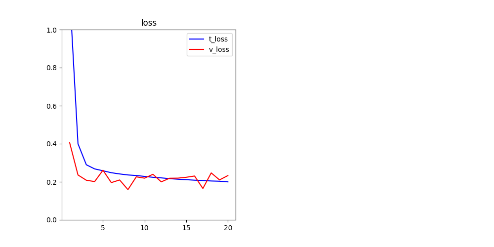
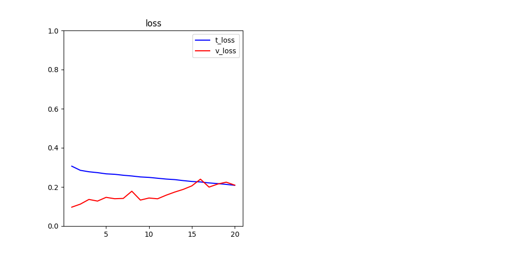

# 六、深度学习用于文本和序列
--
本章包括以下内容：

* 将文本数据处理为有用的数据表示
* 使用循环神经网络
* 使用一维卷积神经网络处理序列

本章将介绍使用深度学习模型处理**文本序列**、**时间序列**、**一般序列**数据<br>
用于处理序列的两种基本的深度学习算法：

* 循环神经网络（recurrent neural network）
* 一维卷积神经网络（1D convnet）（已经大概能想到）

主要应用：

* 文本分类和时间序列分类，比如识别文章的主题或书的作者
* 时间序列对比，比如估测两个文档或两支股票行情的相关程度
* 序列到序列的学习，比如将英语翻译成法语
* 情感分析，比如将推文或电影评论的情感划分为正面或负面
* 时间序列预测，比如根据某地最近的天气数据来预测未来天气

## 6.1 处理文本数据
**深度学习用于自然语言处理是将模式识别应用于单词、句子和段落，这与计算机视觉是将模式识别应用于像素大致相同**<br>

文本向量化(vectorize)是指将文本转换为数值张量的过程。它有多种实现方法：

* 将文本分割为单词，并将每个单词转换为一个向量（1D张量）
* 将文本分割为字符，并将每个字符转换为一个向量
* 提取单词或字符的n-gram，并将每个n-gram转换为一个向量。n-gram是多个连续单词或字符的集合（词袋）

**标记(token)**：将文本分解而成的单元（单词、字符、g-gram）<br>
**分词(tokenization)**：将文本分解成标记的过程<br>
**文本向量化**：文本--*(分词)*-->标记-->*(关联)*-->数值向量


分词方法有很多，关联方法也有很多，两种主要**关联方法**：

* one-hot编码(one-hotencoding)
* 标记嵌入[token embedding,通常只用于单词，叫作**词嵌入(word embedding)**]

### 6.1.1 单词和字符的one-hot编码
每个单词与一个唯一的整数索引相关联，然后将这个整数索引 i 转换为长度为N的二进制向量（N是词表大小），这个向量只有第i个元素是1，其余元素都为0
[one-hot编码](./book6_1.py)

### 6.1.2 使用词嵌入


获取词嵌入有两种方法：

1. **利用Embedding层学习词嵌入**：在完成主任务(比如文档分类或情感预测)的同时学习词嵌入。在这种情况下，一开始是随机的词向量，然后对这些词向量进行学习，其学习方式与学习神经网络的权重相同。
	
	词嵌入的作用应该是将人类的语言映射到几何空间中
	
	从 cat 到 tiger 的向量与从 dog 到 wolf 的向量相等，这个向量可以被解释为“从宠物到野生动物”向量。同样，从 dog 到 cat 的向量与从 wolf 到 tiger 的向量也相等，它可以被解释为“从犬科到猫科”向量。<br>
	但没有一个完美的词嵌入空间能完全映射人类语言，所以，合理的做法是对每个新任务都学习一个新的嵌入空间。反向传播让这种学习变得很简单，keras更简单。我们要做的就是学习一个权重层Embedding层。<br>
	最好将 Embedding 层理解为一个字典，将整数索引(表示特定单词)映射为密集向量。它接收整数作为输入，并在内部字典中查找这些整数，然后返回相关联的向量。Embedding层实际上是一种字典查找<br>
	单词索引 ----> Embedding层 ----> 对应的词向量<br>
	Embedding层的输入是一个二维整数张量，其形状为(samples,sequence\_length)，返回(samples,sequence\_length,embedding\_dimensionality)<br>
	[在IMDB数据上使用Embedding层和分类器,line=29](./book6_1-2.py)，将整数索引(25000,20)映射为密集向量(25000,20,8)<br>
	
2. **预训练词嵌入**：在不同于待解决问题的机器学习任务上预计算好词嵌入，然后将其加载到模型中（👻：类似卷积神经网络使用预训练的模型），可以使用word2vec或GloVe。👻：不知有无中文模型

### 6.1.3 整合在一起:从原始文本到词嵌入
与[book6_1-2.py](./book6_1-2.py)类似：将句子嵌入到向量序列中，然后展平，最后加一个Dense层。但此处使用预训练的词嵌入。此外还使用IMDB原始文本，不使用Keras内置的已经预分词的IMDB数据

1. [下载IMDB数据](http://mng.bz/0tIo)的原始文本，并进行处理
2. 对数据进行分词
3. [下载GloVe词嵌入](https://nlp.stanford.edu/projects/glove/)
4. [整合在一起](./book6_1-3.py)

<center>使用词嵌入</center>
可以在不加载预训练词嵌入、也不冻结嵌入层的情况下训练相同的模型。在这种情况下，你将会学到针对任务的输入标记的嵌入。如果有大量的可用数据，这种方法通常比预训练词嵌入更加强大

<center>不使用词嵌入</center>

### 6.1.4 小结
现在已经学会了下列内容：

* 将原始文本转换为神经网络能够处理的格式
* 使用Keras模型的Embedding层来学习针对特定任务的标记嵌入
* 使用预训练词嵌入在小型自然语言处理问题上获得额外的性能提升

## 6.2 理解循环神经网络
之前的网络：密集连接网络和卷积神经网络都没有记忆性。它们单独的处理每个输入，在输入与输入之间没有保存任何状态。这样的网络想要处理序列，只能向网络展示整个序列，一次性处理。这种网络叫**前馈网络(feedforward network)**<br>
生物智能以渐进的方式处理信息，同时保存一个关于所处理内容的内部模型，这个模型是根据过去的信息构建的，并随着新信息的进入而不断更新<br>
**循环神经网络**采用同样的原理：遍历所有序列，并保存一个**状态**(state)，其中包含与已查看内容相关的信息。<br>

**<center>将前一次的计算输出迭代入到网络中</center>**<br>
一条评论，即一个序列，序列的前一个元素，经过网络后，得到的输出迭代入网络中，下一个元素来的时候，网络中已经有了前所有元素的信息<br>

[一个简单的RNN](./book6_2-1.py)


### 6.2.1 Keras 中的循环层
```
from keras.layers import SimpleRNN
```
与Numpy实现的RNN有个小区别：

* **SimpleRNN**层能够像其他Keras层一样处理序列批量
```
(batch_size, timesteps, input_features)
```

* Numpy示例处理：
```
(timesteps, input_features)
```

**SimpleRNN** 两种运行模式：

* ```return_sequences=False```：返回每个输入序列的最终输出```(batch_size, output_features)```(默认)，每一个序列，都只看最后一步的输出

* ```return_sequences=True```：返回每个时间步连续输出的完整序列```(batch_size, timesteps, output_features)```每一个序列，都看完整过程输出
	
	`batch_size`：批次大小<br>
	`timesteps`：单个序列的长度<br>
	`output_features`：输出特征<br>
	
[simpleRNN用于IMDB电影影评分类问题](./book6_2-3.py)

第3章得的方法得到的精度是88%，此处的精度85%，问题在于：

1. 当前只截取了评论前500个单词
2. SimpleRNN不擅长处理长序列，比如文本

👻：将球队名称编码成序列，结合赔率，看看能否提高精度

### 6.2.2 理解 LSTM 层和 GRU 层

LSTM：long short-term memory，原理：它保存信息以便后面使用，从而防止较早期的信号在处理过程中逐渐消失
```
output_t = activation(dot(state_t, Uo) + dot(input_t, Wo) + dot(C_t, Vo) + bo)
```
```
c_t+1 = i_t * k_t + c_t * f_t
```
### 6.2.3 Keras 中一个 LSTM 的具体例子
[LSTM 用于IMDB电影影评分类问题](./book6_2-4.py)

精度约89%，相对于第3章提升并不算高，主要原因在于：LSTM适用于评论分析全局的长期性结构，对情感分析问题帮助不大
### 6.2.4 小结

* 循环神经网络(RNN)的概念及其工作原理
* 长短期记忆(LSTM)是什么，为什么它在长序列上的效果要好于通 RNN
* 如何使用 Keras 的 RNN 层来处理序列数据

## 6.3 循环神经网络的高级用法
三种高级技巧，提高循环神经网络的性能和泛化能力：

* 循环dropout：recurrent dropout，一种特殊的内置方法，在循环层中使用dropout来降低过拟合。
* 堆叠循环层：stacking recurrent layers，这会提高网络的表示能力
* 双向循环层：bidirectional recurrent layer，将相同的信息以不同的方式呈现给循环网络，可以提高精度并缓解遗忘问题。

### 6.3.1 温度预测问题
[下载数据](https://s3.amazonaws.com/keras-datasets/jena_climate_2009_2016.csv.zip)
### 6.3.2 准备数据
[数据标准化理解](./book6_3-1_test.py)<br>
[数据生成器理解](./book6_3-1.py)
### 6.3.3 一种基于常识的、非机器学习的基准方法
基于常识的预测：24小时后的温度等于现在的温度，使用平均绝对误差(MAE)指标来评估这种方法<br>
[基于常识的、非机器学习的基准](./book6_3-2.py)<br>
MAE=0.29，温度数据被标准化成均值为0、标准差为1，所以无法直接对这个值进行解释。它转化成温度的平均绝对误差为 0.29×temperature_std 摄氏度，即 2.57°C。std[1]是均方差  MAE=(温度-平均值)/均方差
### 6.3.4 一种基本的机器学习方法
[一种基本的机器学习方法对比基于常识的、非机器学习的基准](./book6_3-2.py)

比基准稍稍好一点
这说明我们的常识中包含了大量有价值的信息，而机器学习模型并不知道这些信息。<br>
机器学习一个非常重要的限制：如果学习算法没有被硬编码要求去寻找特定类型的简单模型，那么有时候参数学习是无法找到 简单问题的简单解决方案的
### 6.3.5 第一个循环网络基准
[使用GRU](./book6_3-3.py)

比全连接层要好MAE=0.2，但有过拟合
### 6.3.6 使用循环dropout来降低过拟合
在循环网络中使用dropout的**正确方法**：对每个时间步应该使用相同的dropout掩码(dropout mask，相同模式的舍弃单元)，而不是让 dropout 掩码随着时间步的增加而随机变化<br>
👻：为什么？猜想可能是随机的会妨碍纪录的传导，但相同的模式与减少网络结构有何区别<br>
Yarin Gal使用Keras开展这项研究，并帮助将这种机制直接内置到Keras循环层中<br>
Keras 的每个循环层都有两个与 dropout 相关的参数：
	
* dropout：它是一个浮点数，指定该层 输入单元的 dropout 比率;
* recurrent_dropout：指定循环单元的 dropout 比率

30轮之前不再过拟合，但出现了性能不足，于是添加循环层，循环层堆叠
### 6.3.7 循环层堆叠
使用[循环层堆叠](./book6_3-3.py)提高性能，但效果不明显
### 6.3.8 使用双向RNN
包含两个RNN，分别沿着时间正序和时间逆序对输入序列进行处理<br>
在机器学习中，如果一种数据表示不同但有用，那么总是值得加以利用，这种表示与其他表示的差异越大越好，它们提供了查看数据的全新角度，抓住了数据中被其他方法忽略的内容，因此可以提高模型在某个任务上的性能<br>
利用模型对正向和逆向序列的理解，**集成** 两种表示，提升性能<br>
[双向LSTM 用于IMDB电影影评分类问题](./book6_3-4.py)

加大训练轮次，能否得到更好的结果
### 6.3.9 更多尝试
[👻:加载模型预测温度](./book6_3-3_mytest.py)
还可以尝试：

* 在堆叠循环层中调节每层的单元个数
* 调节 RMSprop 优化器的学习率
* 尝试使用 LSTM 层代替 GRU 层
* 在循环层上面尝试使用更大的密集连接回归器，即更大的 Dense 层或 Dense 层的堆叠
* 不要忘记最后在测试集上运行性能最佳的模型

### 6.3.10 小结
下面是你应该从本节中学到的要点

* 我们在第 4 章学过，遇到新问题时，最好首先为你选择的指标建立一个基于常识的基准。如果没有需要打败的基准，那么就无法分辨是否取得了真正的进步
* 在尝试计算代价较高的模型之前，先尝试一些简单的模型，以此证明增加计算代价是有意义的。有时简单模型就是你的最佳选择
* 如果时间顺序对数据很重要，那么循环网络是一种很适合的方法，与那些先将时间数据展平的模型相比，其性能要更好
* 想要在循环网络中使用<b>dropout</b>，你应该使用一个不随时间变化的 dropout 掩码与循环dropout 掩码。这二者都内置于 Keras 的循环层中
* 与单个 RNN 层相比，<b>堆叠 RNN </b>的表示能力更加强大。但它的计算代价也更高，因此不一定总是需要。虽然它在机器翻译等复杂问题上很有效，但在较小、较简单的问题上可能不一定有用
* <b>双向 RNN </b>从两个方向查看一个序列，它对自然语言处理问题非常有用。但如果在序列数据中最近的数据比序列开头包含更多的信息，那么这种方法的效果就不明显

## 6.4 用卷积神经网络处理序列
### 6.4.1 理解序列数据的一维卷积
👻：类似第五章的卷积神经网络，不过是一维的而已，时间可以看作是一个维度

### 6.4.2 序列数据的一维池化
和二维池化成一样
### 6.4.3 实现一维卷积神经网络
Conv1D：一维卷积层<br>
Conv2D：二维卷积层<br>
👻：不知有无Conv3D、ConvXD。。。：有Conv3D<br>

类似Conv2D接收形状(width, heitht, image_channels)不包括批量维度，卷积窗口是宽和高上的二维窗口 <br>
Conv1D接收形状(samples, time, features)，返回3D张量，卷积窗口是时 间轴上的一维窗口<br>

一维卷积神经网络的架构和二维卷积神经网络的架构相同，用Conv1D和MaxPooling1D层堆叠，最后是一个全局池化层或 Flatten 层，然后添加Dense层，用于分类或回归<br>
[使用简单一维卷积神经网络处理IMDB情感分类问题](./book6_4-1.py)

最高精度87%左右
### 6.4.4 结合CNN和RNN来处理长序列
但一维卷积神经网络对时间步的顺序不敏感（这里所说顺序的范围要大于局部尺度，即大于卷积窗口的大小），可以用卷积层堆叠来处理，但最好的方法是利用RNN<br>
[一维卷积神经网络处理温度☁️预测问题，效果不好，证明卷积神经网络对时间步的顺序不敏感](./book6_4-2.py)<br>
这是因为卷积神经网络在输入时间序列的所有位置寻找模式，它并不知道所看到某个模式的时间位置，对最新数据点的解释与对较早数据点的解释应该并不相同，而IMDB数据并不存在这个问题，因为对于与正面情绪或负面情绪相关联的关键词模式，无论出现在输入句子中的什么位置，它所包含的信息量是一样的<br>
👻：这与IMDB能利用双向RNN，而温度预测问题不能利用RNN的原因类似

在RNN前使用一维CNN作为预处理步骤，对应非常长的序列，此方法尤其有用，因为卷积神经网络会对数据下采样，从而变成更短的序列。[例](./book6_4-3.py)
### 6.4.5 小结
下面是你应该从本节中学到的要点

* 二维卷积神经网络在二维空间中处理视觉模式时表现很好，与此相同，一维卷积神经网络在处理时间模式时表现也很好。对于某些问题，特别是自然语言处理任务，它可以替代 RNN，并且速度更快
* 通常情况下，一维卷积神经网络的架构与计算机视觉领域的二维卷积神经网络很相似，它将 Conv1D 层和 MaxPooling1D 层堆叠在一起，最后是一个全局池化运算或展平操作
* 因为 RNN 在处理非常长的序列时计算代价很大，但一维卷积神经网络的计算代价很小，所以在 RNN 之前使用一维卷积神经网络作为预处理步骤是一个好主意，这样可以使序列变短，并提取出有用的表示交给 RNN 来处理

## 本章总结

* 你在本章学到了以下技术，它们广泛应用于序列数据(从文本到时间序列)组成的数据集
	* 如何对文本分词
	* 什么是循环网络，如何使用循环网络
	* 如何堆叠 RNN 层和使用双向 RNN，以构建更加强大的序列处理模型
	* 如何使用一维卷积神经网络来处理序列
	* 如何结合一维卷积神经网络和 RNN 来处理长序列
* 你可以用 RNN 进行时间序列回归(“预测未来”)、时间序列分类、时间序列异常检测和序列标记(比如找出句子中的人名或日期)。
* 同样，你可以将一维卷积神经网络用于机器翻译(序列到序列的卷积模型，比如SliceNet)、文档分类和拼写校正
* 如果序列数据的**整体顺序很重要**，那么最好使用循环网络来处理。时间序列通常都是这样，最近的数据可能比久远的数据包含更多的信息量
* 如果整体顺序**没有意义**，那么一维卷积神经网络可以实现同样好的效果，而且计算代价更小。文本数据通常都是这样，在句首发现关键词和在句尾发现关键词一样都很有意义
