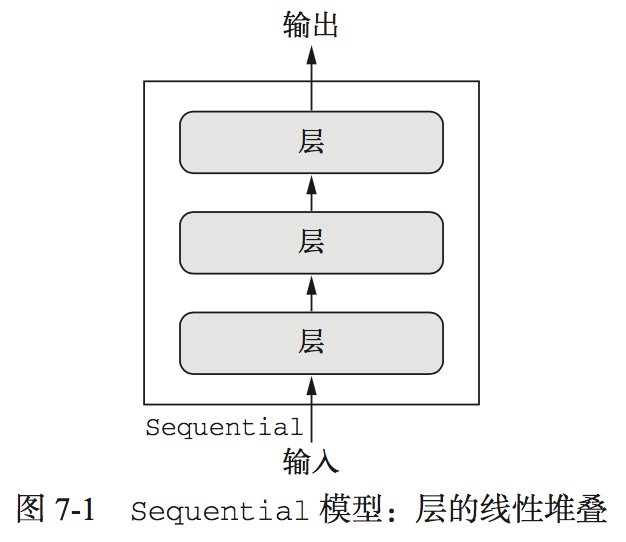
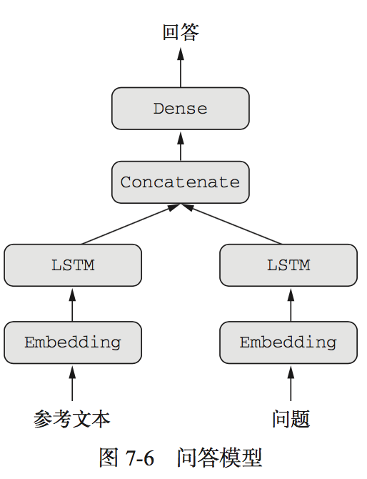
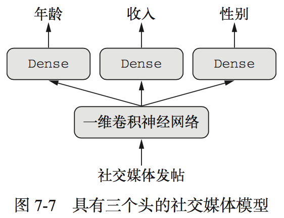
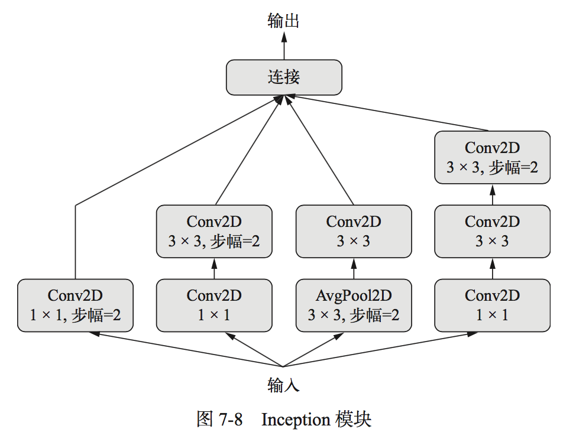
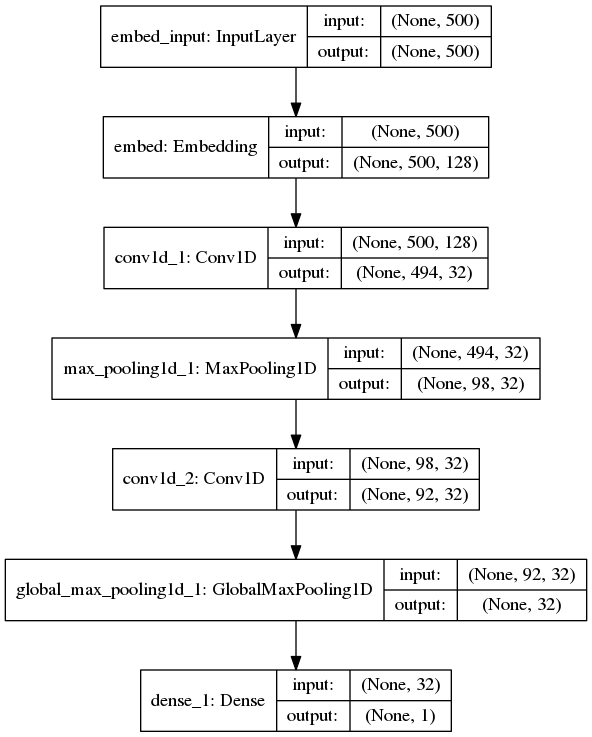

# 七、高级的深度学习最佳实践
本章包括以下内容：

* Keras 函数式 API
* 使用 Keras 回调函数
* 使用 TensorBoard 可视化工具
* 开发最先进模型的重要最佳实践

## 7.1 不用Sequential模型的解决方案
### Keras 函数式 API
到目前为止，见过的神经网络都是用Sequential模型实现的，Sequential模型，假设网络只有一个输入和一个输出，而且网络是层的线性堆叠<center></center>

还有其他问题会用到多输入、多输出、有向无环图等等，就需要函数式**API(functional API)**

### 7.1.1 函数式 API 简介
可以直接操作张量，也可以把层当作**函数**来使用，接收张量并返回张量(因此得名**函数式API**)
[Keras函数式API](./book7_1-1.py)

### 7.1.2 多输入模型
通常情况下，模型会在某一时刻用一个可以组合多个张量的层将不同的输入分支合并。可能是相加或连接。<br>
```
keras.layers.add		# 用于残差连接，原始的x与后层的输出相加
```
```
keras.layers.concatenate	# 用于合并多个分支
```
	
典型的多输入模型 ---- 一个问答模型<br>
两个输入：
1. 参考文本
2. 问题

输出：
1. 回答

<center></center>
[多输入模型，问答分类问题](./book7_1-2.py)

### 7.1.3 多输出模型
比如一个网络，输入某个匿名人士的一系列社交媒体发帖，然后尝试预测那个人的属性，比如年龄、性别和收入水平
<center></center>
[多输出问题](./book7_1-3.py)
### 7.1.4 层组成的有向无环图
一些常用的神经网络组件都以图的形式实现，两个著名的组件：

#### 1. Inception模块
<center></center>
它是模块的堆叠，这些模块本身看起来像是小型的独立网络，被分为多个并行分支，最后将所得到的特征连接在一起<br>
[Inception模块](./book7_1-4.py)<br>
1x1卷积作用在意：区分通道特征学习和空间特征学习。**1x1卷积只混合输入张量的通道特征信息，不混合空间特征信息**<br>
完整的Inception V3架构内置于Keras中，
```
keras.applications.inception_v3. InceptionV3
```
Xception是极端的inception，Xception将分别进行通道特征学习与空间特征学习的想法推向逻辑上的极端，并将 Inception 模块替换为深度可分离卷积，其中包括一个逐深度卷积(即一个空间卷积，分别对每个输入通道进行处理)和后面的一个逐点卷积(即一个 1×1 卷积)。
#### 2. 残差连接
前面层的输出与后面层的激活相加（假设两个激活的形状相同），如果形状不同，可以用一个线性变换将前面层的激活改变成目标形状<br>
[残差连接](./book7_1-5.py)<br>
残差连接解决：梯度消失和表示瓶颈

### 7.1.5 共享层权重
相当于共享某层
[共享层权重](./book7_1-6.py)
### 7.1.6 将模型作为层
👻：卷积神经网络中，使用预训练的网络时，模型微调，类似于将VGG16当作一层或一个模型<br>
函数式API和Sequential类和Model都是如此，这意味着：可以在一个输入张量上调用模型，并得到一个输出张量
```y = model(x)```，多输入或多输出```y1, y2 = model([x1, x2])```
[将模型作为层](./book7_1-7.py)

### 7.1.7 小结
* 可以用函数式API```model=models.Model([input1,input2,...],[outpu1,output2,...])```来构建模型
* 多种形式：
	* [多输入](./book7_1-2.py)
	```
	model = models.Model([i1, i2, i3, ...], output)
	```
	* [多输出](./book7_1-3.py)
	```
	model = models.Model(input, [o1, o2, o3, ...])
	```
	模型最后一层：激活要对应各自输出<br>
	编译模型时：loss要对应各自输出，还要进行损失平衡loss_weights
	* 有向无环图
		* [inception模块](./book7_1-4.py)，分为多个分支，不同的侧重点，最后合并concatenate
		* [残差连接](./book7_1-5.py)，将前几层的输出与后几层的输出add，解决**梯度消失**和**表示瓶颈**问题
	* [共享层权重](./book7_1-6.py)，共同使用某一层
	* [将模型作为层](./book7_1-7.py)，层既是模型，模型既是层


## 7.2 使用 Keras 回调函数和 TensorBoard 来检查并监控深度学习模型
### 7.2.1 训练过程中将回调函数作用于模型
使用回调函数的目的：使得训练可控<br>
***回调函数*** ：callback是调用fit时传入模型的一个对象，它在训练过程中的不同时间点都会被调用<br>
回调函数可以访问模型性能和状态，还能采取行动，中断训练、保存模型、加载一组不同的权重或改变模型的状态<br>

一些用法：

* **模型检查点(model checkpointing)**：在训练过程中的不同时间点保存模型的当前权重，```keras.callbacks.ModelCheckpoint```
* **提前终止(early stopping)**：如果验证损失不再改善，则中断训练(当然，同时保存在训练过程中得到的最佳模型)```keras.callbacks.EarlyStopping```
* **在训练过程中动态调节某些参数值**：比如优化器的学习率
* **在训练过程中记录训练指标和验证指标，或将模型学到的表示可视化**：(这些表示也在不断更新)：你熟悉的 Keras 进度条就是一个回调函数!

常用的：

```
keras.callbacks.ModelCheckpoint 
keras.callbacks.EarlyStopping
keras.callbacks.LearningRateScheduler
keras.callbacks.ReduceLROnPlateau
keras.callbacks.CSVLogger
```
#### 1.ModelCheckpoint 与 EarlyStopping 回调函数
[ModelCheckpoint 与 EarlyStopping 回调函数示例](./book7_2-1.py)
#### 2.ReduceLROnPlateau 回调函数
如果验证损失不再改善，你可以使用这个回调函数来降低学习率
[ReduceLROnPlateau 回调函数示例](./book7_2-2.py)
#### 3.自定义回调函数
自定义回调函数，继承`keras.callbacks.Callback`类即可

继承`keras.callbacks.Callback`类需要实现如下方法：

```
on_epoch_begin	# 在每轮开始时被调用
on_epoch_end	# 在每轮结束时被调用
on_batch_begin	# 在处理每个批量之前被调用
on_batch_end	# 在处理每个批量之后被调用
on_train_begin	# 在训练开始时被调用
on_train_end	# 在训练结束时被调用
```

回调函数还可以访问下列属性：

```
self.model				# 调用回调函数的模型实例
self.validation_data	# 传入fit作为验证数据的值
```
[自定义回调函数示例](./book7_2-3.py)<br>
[可参考](https://blog.csdn.net/qq_27825451/article/details/93377801)

### 7.2.2 TensorBoard 简介:TensorFlow的可视化框架
tensorBoard具有下列巧妙功能：

* 在训练过程中以可视化的方法监控指标
* 将模型架构可视化
* 将激活和梯度可视化
* 以三维的形式研究嵌入

tensorBoard其实就是一个回调函数<br>
[使用tensorBoard可视化](./book7_2-4.py)<br>
[keras版本问题](./关于tensorBoard使用bug问题.md)

运行完成，存储日志到相应目录，`tensorboard --logdir=my_log_dir_7_2-4`
启动可视化服务，地址`http://localhost:6006/`

还可以[使用plot_model函数显示模型结构](./book7_2-5.py)

<center></center>
### 7.2.3 小结
* Keras 回调函数提供了一种简单方法，可以在训练过程中监控模型并根据模型状态自动采取行动
* 使用 TensorFlow 时，TensorBoard 是一种在浏览器中将模型活动可视化的好方法。在Keras 模型中你可以通过 TensorBoard 回调函数来使用这种方法

## 7.3 让模型性能发挥到极致
本节中，我们将为你提供一套用于构建最先进深度学习模型的必备技术的快速指南，从而让模型由“**具有不错的性能**”上升到“**性能卓越且能够赢得机器学习竞赛**”。

### 7.3.1 高级架构模式
模型设计模式：

* [残差连接](./book7_1-5.py)
* 标准化
* 深度可分离卷积

1. 批标准化(batch normalization)：一种层的类型，Keras 中是BatchNormalization

	👻：**在每一层对数据变换后都对数据进行标准化，有助于反向传播，防止剃度消失，这一点和残差连接很像**

	数据标准化：最常见的，将数据减去其平均值使其中心为 0，然后将数据除以其标准差使其标准差为 1，这种做法假设数据服从正态分布，但数据在层之间进行变换后，未必满足数据标准化要求，**批标准化**就是结局这一问题
	
	**工作原理**：训练过程中在内部保存已读取每批数据均值和方差的指数移动平均值
	
	**主要效果**：它有助于梯度传播
	
	BatchNormalization层通常 卷积层 或 密集连接层 后使用，BatchNormalization层接收一个axis参数，指定应该对哪个特征轴做标准化，默认值 -1
	
	**批再标准化(batch renormalization)**很可能取代批标准化，**自标准化神经网络(self-normalizing neural network)**能数据通过任何 Dense 层之后保持数据标准化

2. 深度可分离卷积层（depthwise separable convolution），👻：将**空间特征**学习和**通道特征**学习分开

	这个层对输入的每个通道分别执行空间卷积（学习空间特征），然后通过逐点卷积(1×1 卷积)将输出通道混合（学习通道特征）
	
	**1x1卷积只混合输入张量的通道特征信息，不混合空间特征信息**
	
	[深度可分离卷积](./book7_3-1.py)
	
	深度可分离卷积是Xception结构的基础

### 7.3.2 超参数优化
**超参数**：用多少层，用什么层，所用层级的参数

**模型参数**：模型内部权重

这个过程的**关键**在于，给定许多组超参数，使用**验证性能的历史**来选择下一组需要评估的超参数的算法。有多种不同的技术可供选择:贝叶斯优化、遗传算法、简单随机搜索等

**超参数自动化很关键但还不成熟**

目前是随机搜索、Hyperopt（一个用于超参数优化的 Python 库）、Hyperas（将 Hyperopt 与 Keras 模型集成在一起）

[一定要试试**Hyperas**](http://yangguang2009.github.io/2017/01/08/deeplearning/grid-search-hyperparameters-for-deep-learning/)

[待完成](./book7_3-2.py)

注意⚠️：在进行大规模超参数自动优化时，有一个重要的问题需要牢记，那就是验证集过拟合

### 7.3.3 模型集成
👻：集成多个模型的结果，有点类似之前的双向RNN，从不同的角度观察数据，page=185

在机器学习中，如果一种数据表示不同但有用，那么总是值得加以利用，这 种表示与其他表示的差异越大越好，它们提供了查看数据的全新角度，抓住了数据中被其他方 法忽略的内容，因此可以提高模型在某个任务上的性能

分类器集成最简单的方法是取预测结果的加权平均值：

```
preds_a = model_a.predict(x_val)
preds_b = model_b.predict(x_val)
preds_c = model_c.predict(x_val)
preds_d = model_d.predict(x_val)
# 更好的分类器被赋予更大的权重，而较差的分类器则被赋予较小的权重
final_preds = 0.5 * preds_a + 0.25 * preds_b + 0.1 * preds_c + 0.15 * preds_d 

```
想要保证集成方法有效，关键在于这组分类器的**多样性**，因此，集成的模型应该**尽可能好**，同时**尽可能不同**

作者在实践中发现非常有效的方法：将基于树的方法和深度神经网络进行集成，树🌲比如随机森林或梯度提升树

### 7.3.4 小结

## 本章总结