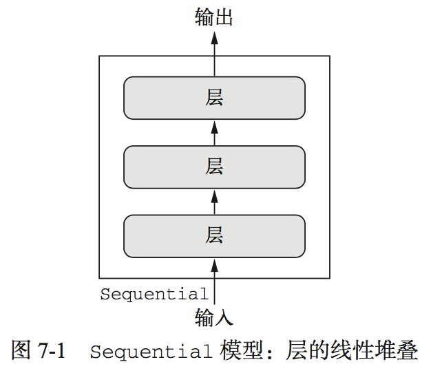

# 七、高级的深度学习最佳实践
本章包括以下内容：

* Keras 函数式 API
* 使用 Keras 回调函数
* 使用 TensorBoard 可视化工具
* 开发最先进模型的重要最佳实践

## 7.1 不用Sequential模型的解决方案
### Keras 函数式 API
到目前为止，见过的神经网络都是用Sequential模型实现的，Sequential模型，假设网络只有一个输入和一个输出，而且网络是层的线性堆叠

还有其他问题会用到多输入、多输出、有向无环图等等，就需要函数式**API(functional API)**

### 7.1.1 函数式 API 简介
可以直接操作张量，也可以把层当作**函数**来使用，接收张量并返回张量(因此得名**函数式API**)
[Keras函数式API](./book7_1-1.py)

### 7.1.2 多输入模型
通常情况下，模型会在某一时刻用一个可以组合多个张量的层将不同的输入分支合并。可能是相加或连接。<br>
```
keras.layers.add		# 用于残差连接，原始的x与后层的输出相加
```
```
keras.layers.concatenate	# 用于合并多个分支
```
	
典型的多输入模型 ---- 一个问答模型<br>
两个输入：
1. 参考文本
2. 问题

输出：
1. 回答


[多输入模型，问答分类问题](./book7_1-2.py)

### 7.1.3 多输出模型
比如一个网络，输入某个匿名人士的一系列社交媒体发帖，然后尝试预测那个人的属性，比如年龄、性别和收入水平

[多输出问题](./book7_1-3.py)
### 7.1.4 层组成的有向无环图
一些常用的神经网络组件都以图的形式实现，两个著名的组件：

#### 1. Inception模块

它是模块的堆叠，这些模块本身看起来像是小型的独立网络，被分为多个并行分支，最后将所得到的特征连接在一起<br>
[Inception模块](./book7_1-4.py)<br>
1x1卷积作用在意：区分通道特征学习和空间特征学习<br>
完整的Inception V3架构内置于Keras中，
```
keras.applications.inception_v3. InceptionV3
```
Xception是极端的inception，Xception将分别进行通道特征学习与空间特征学习的想法推向逻辑上的极端，并将 Inception 模块替换为深度可分离卷积，其中包括一个逐深度卷积(即一个空间卷积，分别对每个输入通道进行处理)和后面的一个逐点卷积(即一个 1×1 卷积)。
#### 2. 残差连接
前面层的输出与后面层的激活相加（假设两个激活的形状相同），如果形状不同，可以用一个线性变换将前面层的激活改变成目标形状<br>
[残差连接](./book7_1-5.py)

### 7.1.5 共享层权重
### 7.1.6 将模型作为层
### 7.1.7 小结


## 7.2 使用 Keras 回调函数和 TensorBoard 来检查并监控深度学习模型
### 7.2.1 训练过程中将回调函数作用于模型
### 7.2.2 TensorBoard 简介:TensorFlow的可视化框架
### 7.2.3 小结

## 7.3 让模型性能发挥到极致
### 7.3.1 高级架构模式
### 7.3.2 超参数优化
### 7.3.3 模型集成
### 7.3.4 小结

## 本章总结