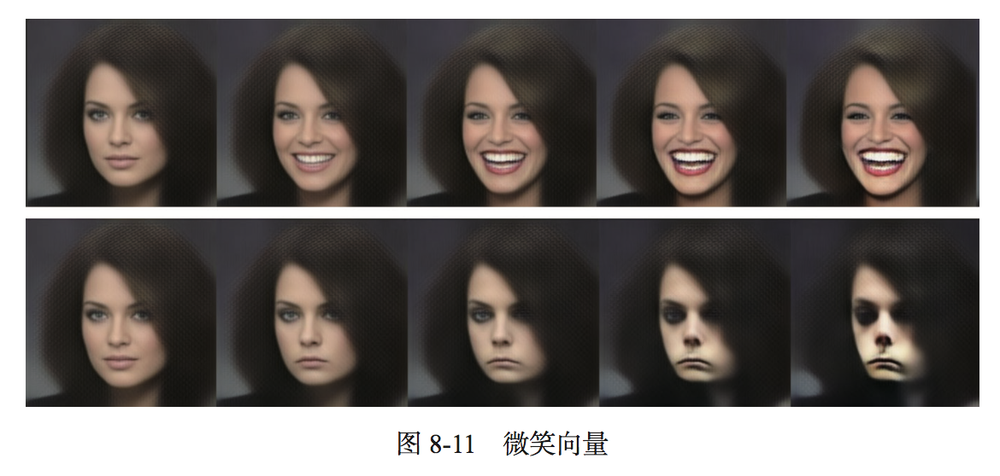

# 八、生成式深度学习
本章包括以下内容:

* 使用LSTM生成文本
* 使用DeepDream
* 使用神经风格迁移
* 变分自编码
* 了解生成式对抗网络

机器学习模型能够对图像、音乐和故事的统计**潜在空间(latent space)**进行学习，然后从这个空间中**采样(sample)**，创造出与模型在训练数据中所见到的艺术作品具有相似特征的新作品。

它从一种与我们的经验完全不同的经验中进行学习

作为人类旁观者，只能靠我们的解释才能对模型生成的内容赋予意义。

👻：生成的内容本身没有什么意义，人类的解释才能对内容赋予意义

👻：和自监督学习有何关系

## 8.1 使用LSTM生成文本
本节将会探讨如何将循环神经网络用于生成序列数据
### 8.1.1 生成式循环网络简史
2013年Alex Graves 利用笔触位置的时间序列将循环混合密度网络应用于生成 类似人类的手写笔迹，有人认为这是一个转折点。

“序列数据生成是计算机所做的最接近于做梦的事情。”

从那以后，循环神经网络已被成功应用于音乐生成、对话生成、图像生成、语音合成和分 子设计。它甚至还被用于制作电影剧本，然后由真人演员来表演。

### 8.1.2 如何生成序列数据
通用方法：使用前面的标记 作为 **输入**，训练一个网络，来**预测**序列中接下来的**一个或多个标记**<br>
例如：给定输入 “the cat is on the ma”，训练网络来预测下一个字符 "t"

**语言模型(language model)**：给定标记，能够对下一个标记的概率进行建模的任何网络

**潜在空间(latent space)**：语言的统计结构

**整体流程**：向模型中输入一个初始文本字符串，要求模型生成下一个字符或下一个或多个单词，然后将生成的输出添加到输入数据中，多次重复这一过程
<center></center>

### 8.1.3 采样策略的重要性

* **贪婪采样(greedy sampling)**：贪婪抽取，从模型预测的下一个字符的概率分布中，抽取概率最大的
* **随机采样(stochastic sampling)**：随机抽取，从模型预测的下一个字符的概率分布中，随机抽取
* 贪婪抽取最具有更加可预测的结构，随机抽取最更有创造性的结构，控制偏向哪边的参数 设定为temperature，取汁0～1，
`temperature=0 #贪婪抽取`
`temperature=1 #随机抽取`

[对于不同的 softmax 温度，对概率分布进行重新加权x](./images/book8_1-1.py)

### 8.1.4 实现字符级的LSTM文本生成
[实现字符级的LSTM文本生成](./book8_1-2.py)

温度temperature越高，越随机

该模型所做的只是从一个统计模型中对数据进行采样，这个模型是关于**字符先后顺序**的模型；信息的**内容**与信息**编码的统计结构**是有区别的

### 8.1.5 小结

* 我们可以生成离散的序列数据，其方法是:给定前面的标记，训练一个模型来预测接下来的一个或多个标记。
* 对于文本来说，这种模型叫作**语言模型**。它可以是单词级的，也可以是字符级的。
* 对下一个标记进行采样，需要在坚持模型的判断与引入随机性之间寻找平衡。
* 处理这个问题的一种方法是使用 softmax 温度。一定要尝试多种不同的温度，以找到合适的那一个。

## 8.2 DeepDream
### 8.2.1 用Keras实现DeepDream
[用Keras实现DeepDream](./book8_2-1.py)

从目的构建损失loss，定义一个原始输入x，找到损失loss相对于输入x的梯度grads，损失loss、输入x、梯度grads都有了，构建函数loss,grads = f(x)，沿着loss最大化的方向去反向改变输入x，得到最终想要的结果

比如DeepDream，目的是要得到某几层的输出特性，loss就应该是这几层所有每层所有通道的输出的层加权平均，使用backend.gradients()函数可以得到损失loss相对于输入x的梯度grads，使用 backend.function()构建函数，沿着时loss最大化的方向改变输入x，得到代表该几层的输入图像DeepDream

### 8.2.2 小结

* DeepDream 的过程是反向运行一个卷积神经网络，基于网络学到的表示来生成输入。
* 得到的结果是很有趣的，有些类似于通过迷幻剂扰乱视觉皮层而诱发的视觉伪影。
* 注意，这个过程并不局限于图像模型，甚至并不局限于卷积神经网络。它可以应用于语音音乐等更多内容。

## 8.3 神经风格迁移
**神经风格迁移**是指：将**参考图像的风格**应用于**目标图像**，同时保留目标图像的内容


实现风格迁移背后的**关键概念**与所有深度学习算法的**核心思想**是一样的：**定义一个损失函数来指定想要实现的目标，然后将这个损失最小化**

```
loss = 
distance(
	style(reference_image)-style(generated_image)	# 参考图片的风格-生成图片的风格 = 风格损失，生成图像的风格尽可能接近参考图像的风格
) +
distance(
	content(originnal_image)-content(generated_image) 	# 原始图片的内容-生成图片的内容 = 内容损失,生成图像的内容尽可能接近原始图像的内容
) 
# 将loss最小化，则目标图片的风格就回接近与参考图片的风格，目标图片的内容就回接近与原始图片的内容，
# distance 是一个范数函数，比如 L2 范数
```
Gatys 等人发现了一个很重要的观察结果，就是**深度卷积神经网络**能够从数学上定义 **style** 和 **content** 两个函数

### 8.3.1 内容损失
网络更靠底部的层激活包含关于图像的**局部**信息，而更靠近顶部的层则包含更加**全局**、更加**抽象**的信息，因此：

👻：顶部层---内容，底部层不对应风格，而是层的内部相互关系---纹理\风格

风格损失：两个激活之间的L2范数，一个激活是预训练的卷积神经网络靠**顶部**某层在**原始图像**上得到的激活，另一个激活是**同一层**在**生成图像**上得到的激活

该层的所有特征的激活

```
loss_content=distance(content_originnal-content_generated)
```

### 8.3.2 风格损失
层的内部关系---风格\纹理

为了保证在**风格参考**图像与**生成图像**之间，在**不同空间尺度**中，找到的**纹理**看起来都很**相似**

必须要实现：**风格参考**图像与**生成图像**之间，在**不同的层激活内**，要保存**相似**的**内部相互关系**

👻：不同空间尺寸---不同层激活；纹理---内部相互关系(内积)

### 8.3.3 用Keras实现神经风格迁移

损失 = 内容损失+风格损失：

* 在**原始内容图像**和**生成图像**之间保持相似的**较高层**激活---内容
* 在**较低层**和**较高层**的激活中保持类似的**相互关系**(correlation)---风格\纹理，且是不同空间尺度中

神经风格迁移的一般过程如下：

1. **创建一个网络**，它能够同时计算三个图像的VGG19的层激活，原始图像、参考图像、生成图像
2. 使用这三张图像上计算的层激活来**定义**之前所述的**损失函数**，为了实现风格迁移，需要将这个损失函数最小化
3. **设置梯度下降过程**来将这个损失函数最小化。

[具体实现](./book8_3-1.py)


其实该方法只是纹理迁移，无法实现比较抽象的迁移

风格迁移算法非常慢，实现快速风格迁移的方法是，对一张固定的风格参考图片，生成足够多的输入-输出训练样例，然后训练一个简单的卷积神经网络来学习这个风格变换

👻：获取足够多的微信马赛克图片，输出-输入样例，是否能实现去马效果

### 8.3.4 小结

* 风格迁移是指创建一张新图像，保留目标图像的内容的同时还抓住了参考图像的风格
* 内容可以被卷积神经网络更靠顶部的层激活所捕捉到
* 风格可以被卷积神经网络不同层激活的内部相互关系所捕捉到
* 因此，深度学习可以将风格迁移表述为一个最优化过程，并用到了一个用预训练卷积神经网络所定义的损失
* 从这个基本想法出发，可以有许多变体和改进

## 8.4 用变分自编码器生成图像
* **变分自编码器**（VAE， variational autoencoder）
* **生成式对抗网络**（GAN，generative adversarial network）

### 8.4.1 从图像的潜在空间中采样
图像生成的关键思想就是找到一个**低维的表示 潜在空间**，其中任意点都可以被映射为一张逼真的图像。👻：何为低维，1维2维...，这样的空间中，任意点都可以 **映射** 为一张逼真的图像，这样对这个空间中的点进行采样，就可以得到各种逼真的图像。

能实现这种映射的模块，即生成起(generator)/解码器(decoder)


GAN和VAE就是学习这种潜在空间的策略：

* VAE 非常适合用于学习具有良好结构的潜在空间，其中特定方向表示数据中有意义的 变化轴
* GAN 生成的图像可能非常逼真，但它的潜在空间可能没有良好结构，也 没有足够的连续性。

### 8.4.2 图像编辑的概念向量
概念向量（concept vector）：给定一个表示的潜在空间或一个嵌入空间，空间中的特定方向可能表示原始数据中有趣的变化轴。👻：词潜入

一旦找到了这样的向量， 就可以用这种方法来编辑图像：将图像投射到潜在空间中，用一种 **有意义的方式** 来移动其表示， 然后再将其解码到图像空间。

对于人脸图像而言，如可以找到微笑向量，向人脸添加墨镜的向量、去掉墨镜的向量，将男性面孔变成女性面孔的向量等

图 8-11 是一个微笑向量的例子，它是由新西兰维多利亚大学设计学院的 Tom White 发现的概念 向量，使用的是在名人人脸数据集(CelebA 数据集)上训练的 VAE。

### 8.4.3 变分自编码器
变分自编码器是：一个特别适用于 *利用概念向量* 进行图像编辑的任务的 自编码器**生成式模型**

自编码器：一种网络类型，其目的是将输入编码到低维潜在空间，然后再解码回来

自编码器接收一张图像，通过一个 *编码器模块* 将其映射到潜在向量空间，然后再通过一个 *解码器模块* 将其解码为与原始图像具有相同尺寸的输出


使用与输入图像相同的图像作为目标数据来训练这个自编码器，也就是说，自编码器学习对原始输入进行重新构建

👻：与词嵌入相比，相同的结构，词潜入是在 处理特定文本序列 的训练过程中 边训练如何处理 边构建针对这个文本序列的潜入空间。而图像自编码器，是在学习对原始输入进行重新构建

👻：如果单词和图片可以进行有意义的嵌入，其他数据形式呢

在实践中，这种经典的自编码器不会得到特别有用或具有良好结构的潜在空间。但是，VAE 向自编码器添加了一点统计魔法，迫使其学习连续的、高度结构化的潜在空间。

VAE 不是将输入图像压缩成潜在空间中的固定编码，而是将图像转换为统计分布的参数，即**平均值**和**方差**。本质上来说，这意味着我们假设输入图像是由统计过程生成的，在编码和解码过程中应该考虑这一过程的随机性。👻：每个人手写数字“2”不太一样，但都能认出是“2”，然后，VAE 使用平均值和方差这两个参数来从分布中随机采样一个元素，并将这个元素解码到原始输入(见图 8-13)。**这个过程的随机性提高了其稳健性**，并迫使潜在空间的任何位置都对应有意义的表示，即潜在空间采样的每个点都能解码为有 效的输出。


从技术角度来说，VAE的工作原理如下：

1. 一个编码器模块将输入样本 input\_img 转换为表示潜在空间中的两个参数z\_mean和z\_log\_variance
2. 我们假定潜在正态分布能够生成输入图像，并从这个分布中随机采样一个点z：`z=z_mean+exp(0.5*z_log_variance)*epsilon`epsilon是取值很小的随机张量
3. 一个解码器模块将潜在空间的这个点映射回原始输入图像

	👻：e^(0.5\*方差)*epsilon+z_mean

VAE的参数通过两个损失函数来进行训练：

1. 重构损失（reconstruction loss）：它迫使解码后的样本匹配初始输入
2. 正则化损失（regularization loss）：它有助于学习具有良好结构的潜在空间，并可以降低在训练数据上的过拟合

```
z_mean,z_log_variance = encode(input_img)
z = z_mean + exp(0.5*z_log_variance) * epsilon
reconstructed_img = decoder(z)
model = Model(input_img, reconstructed_img)
```
使用 **重构损失** 和 **正则化损失** 来训练模型
	
👻：重构损失= reconstructed_img \- input\_img?

👻：构建关系f，找到具体的关系

[用变分自编码器生成图像](./book8_4-2.py)
<center></center>

[其他尝试](./book8_4-3.py)<br>
 <center></center>

### 8.4.4 小结
* **用深度学习进行图像生成，就是通过对潜在空间进行学习来实现的，这个潜在空间能够捕捉到关于图像数据集的统计信息**，通过对潜在空间中的点进行采样和解码，我们可以 生成前所未见的图像。这种方法有两种重要工具:变分自编码器(VAE)和生成式对抗网络(GAN)。
* VAE 得到的是高度结构化的、连续的潜在表示。因此，它在潜在空间中进行各种图像编辑的效果很好，比如换脸、将皱眉脸换成微笑脸等。它制作基于潜在空间的动画效果也很好，比如沿着潜在空间的一个横截面移动，从而以连续的方式显示从一张起始图像缓慢变化为不同图像的效果。
* GAN 可以生成逼真的单幅图像，但得到的潜在空间可能没有良好的结构，也没有很好的连续性。
* [大规模名人人脸(CelebA)数据集](http://mmlab.ie.cuhk.edu.hk/projects/CelebA.html)特别适合用概念向量进行实验

## 8.5 生成式对抗网络简介
直观理解：一个伪造者，想要伪造毕加索的画作，一开始不擅长，伪造了一些，交给一艺术商人，艺术商人对每幅画进行评估，并返回给伪造者哪不像，伪造者改进自己，再次伪造，随时间推移，伪造者越来越擅长伪造，艺术商人也越来越擅长鉴别，最后，得到了很解决的毕加索画作的赝品

工作原理：一个伪造者网络和一个专家网络，二者训练的目的都是为了打败彼此。

组成：

* **生成器网络**（generator network）：它以一个随机向量(潜在空间中的一个随机点)作为输入，并将其解码为一张合成图像。👻：相当于VAE的解码部分
* **判别器网络**（discriminator network）或**对手**（adversary）：以一张图像(真实的或合成的 均可)作为输入，并预测该图像是来自训练集还是由生成器网络创建。

👻：相当于增加一个网络来代替人，做图灵测试，测试能不能分辨出图像是机器生成的还是真实的


值得注意⚠️：GAN这个系统与其他普通网络训练方法都不同，它的优化最小值是不固定的。通常来说，梯度下降是沿着静态的损失地形滚下山坡。但对于 GAN 而言，每下山一步，都会对整个地形造成一点改变。它是一个动态的系统，其最优化过程寻找的不是一个最小值，而是两股力量之间的平衡。

我判别的结果会影响你，而你受影响后生成的东西，会影响我的判别

👻：生成式对抗网络可以看作是一种强化学习

### 8.5.1 GAN的简要实现流程
1. generator网络将形状为 (latent_dim,) 的向量映射到形状为 (32,32,3) 的图像
2. discriminator网络将形状为 (32,32,3)的图像映射到一个二进制分数，用于评估图像为真的概率
3. gan网络将 generator 网络和 discriminator 网络连接在一起：`gan(x) = discriminator(generator(x))`，生成器将潜在空间向量解码为图像，判别器对这些图像的真实性进行评估
4. 我们使用带有“真”/“假”标签的真假图像样本来训练判别器，就和训练普通的图像分类模型一样
5. 为了训练生成器，我们要使用 **gan 模型的损失**相对于**生成器权重**的**梯度**（👻：生成器权重对gan模型损失的影响），训练时就是移动生成器的权重，移动方向是使判别器更有可能判断为真的方向移动。我们要训练生成器来欺骗判别器

训练的过程，生成器每次生成，给判别器，判别器给出反馈生成器再次尝试，生成器是一个不断试错的过程，同时判别器看了答案，也在进化自己

### 8.5.2 大量技巧
目前的技巧更像是炼金术而不是科学，可能AutoML能解决这个问题

* 我们使用tanh作为生成器最后一层的激活，而不用sigmoid，后者在其他类型的模型中更加常见。
* 我们使用正态分布（高斯分布）对潜在空间中的点进行采样，而不用均匀分布。
* 随机性能够提高稳健性。训练GAN得到的是一个动态平衡，所以GAN可能以各种方式“卡住”。在训练过程中引入随机性有助于防止出现这种情况。我们通过两种方式引入随机性：一种是在判别器中使用dropout，另一种是向判别器的标签添加随机噪声。
* 稀疏的剃度会妨碍GAN的训练。在深度学习中，稀疏性通常是我们需要的属性，但在GAN中并非如此。有两件事情可能导致梯度稀疏:最大池化运算和 ReLU 激活。我们推荐使用步进卷积代替最大池化来进行下采样，还推荐使用 LeakyReLU 层来代替 ReLU 激活。LeakyReLU 和 ReLU 类似，但它允许较小的负数激活值，从而放宽了稀疏性限制。
* 在生成的图像中，经常会见到棋盘状伪影，这是由生成器中像素空间的不均匀覆盖导致的（见图）。为了解决这个问题，每当在生成器和判别器中都使用步进的 Conv2DTranpose或 Conv2D 时，**使用的内核大小要能够被步幅大小整除**

### 8.5.3 生成器
### 8.5.4 判别器
### 8.5.5 对抗网络
### 8.5.6 如何训练DCGAN

循环流畅大致如下：

1. 从潜在空间中抽取随机点（随机噪声）
2. 利用这个随机噪声用generator生成图像
3. 奖真假图像混合
4. 使用这些混合后的图像以及标签来训练判别器
5. 再次从潜在空间中抽取随机点
6. 使用这些随机向量以及 **全部是“真实图像”的标签** 来训练gan，此时判别器在gan中时冻结的，这时反馈会作用于生成器，让生成器去朝着生成更真实的方向去改变自己，这个过程是训练生成器去欺骗判别器

要训练判别器和生成器，目标是生成器。有三种训练想法：

* 先用<真假图片--标签>训练判别器，冻结住判别器，再用<空间点--都为真的标签(谎言)>来训练gan（此时只能训练到生成器朝着真实方向改变）
* 用<空间点--标签>来训练gan，空间点是采样点和真实点混合，标签也是混合，但是真实点需要另写一个编码器来完成
* 用真实图片与生成图片之间的误差最小化来训练生成器

[gan实现](./book8_5-2.py)


理解图片变成tensor是三维(w,h,3)，每个点都有自己的数值，每个维度上的坐标值不能超过自己所在维度大小，不要把最后一个3和255混淆，3是坐标，255某个位置取值范围

### 8.5.7 小结
* GAN由一个生成器网络和一个判别器网络组成。判别器的训练目的是能够区分生成器的输出与来自训练集的真实图像，生成器的训练目的是欺骗判别器。**值得注意的是，生成器从未直接见过训练集中的图像，它所知道的关于数据的信息都是来自判别器**
* GAN很难训练，因为训练GAN，需要使用一些启发式技巧，还需要大量的调节。
* GAN可能会生成非常逼真的图像。但与VAE不同，GAN学习的潜在空间没有整齐的连续结构，因此可能不适用于某些实际应用，比如通过潜在空间概念向量进行图像编辑。

## 本章总结
* 借助深度学习的创作性应用，深度网络不仅能够对现有内容进行标注，还能自己生成新内容。本章我们学到的内容如下	
	* 如何生成序列数据，每次生成一个时间步。这可以应用于文本生成，也可以应用于逐个音符🎵的音乐生成或其他任何类型的时间序列数据
	* DeepDream的工作原理：通过输入空间中的梯度上升将卷积神经网络的层激活最大化。
	* 如何实现风格迁移，即将内容图像和风格图像组合在一起，并产生有趣的效果。
	* 什么是对抗式生成网络（GAN），什么是变分自编吗（VAE），它们如何用于创造新图像，以及如何使用前在空间概念向量进行图像编辑。
* 这几项技术仅涉及了这一快速发展领域的基础知识，还有许多内容等待你去探索。仅生成式深度学习这一领域的内容就可以写一整本书。